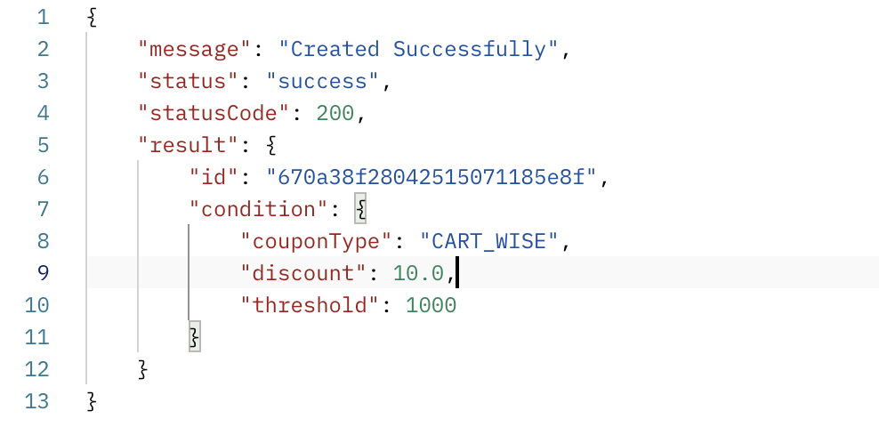
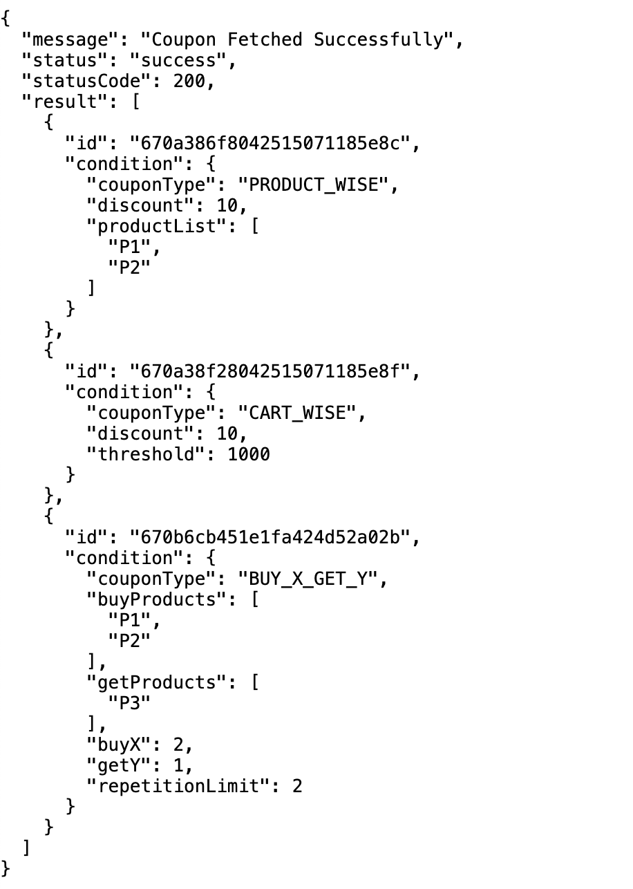
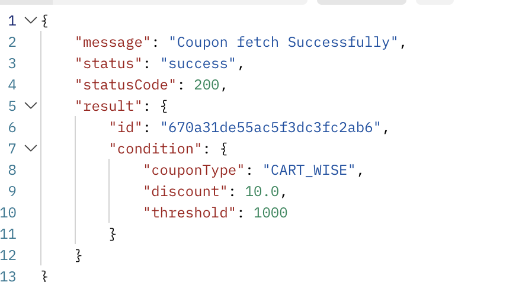
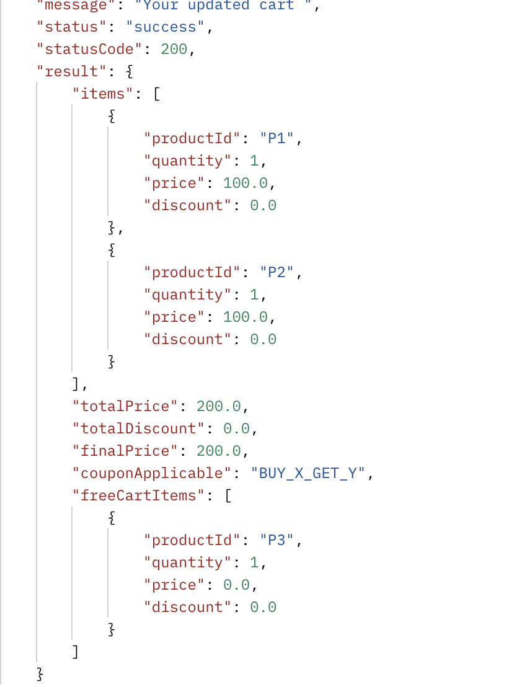
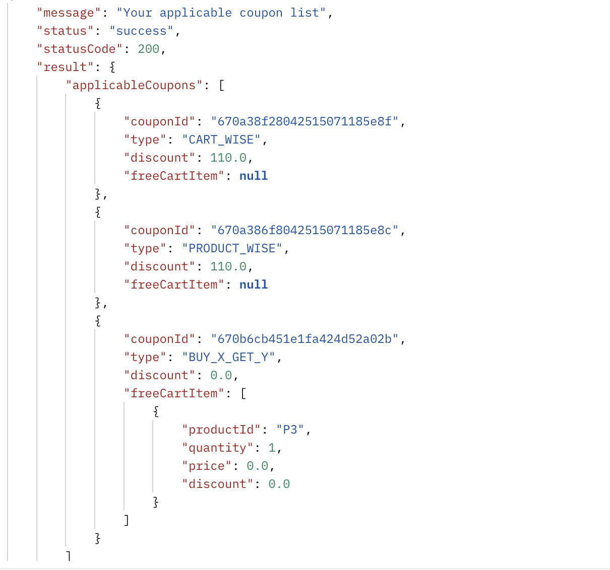

# Coupons Management API

## Objective
Build a REST API to manage and apply different types of discount coupons for an e-commerce platform.

## Implemented Cases
1. **Cart-wise Coupons**: Discounts applied if the cart total exceeds a certain threshold.
2. **Product-wise Coupons**: Discounts applied to specific products.
3. **BxGy Coupons**: "Buy X, Get Y" deals with repetition limits.
4. **Expiration Dates**: Coupons with expiration dates were not considered for applying on cart. If user 
                         give them in request it will throw error with proper message.

## Which db I Use!
Mongo db i choose for coupons. As condition of coupon is changing, which is unstructured and can easily handled by same.

## Unimplemented Cases
1 **Advanced Validation**: More complex validation rules for coupon applicability.

## Limitations
- In my current implementation i use mongo for coupons where I mentions product id, which need to alter when 
  new product will be added. I choose sql (postgres) for product entity.
- The coupon details are stored as a JSON string, which may complicate querying specific attributes.

## Assumptions
- Coupon id is string
- The API assumes that product IDs are valid and exist in the system.
- The discount calculations do not account for taxes or shipping fees.

## API Endpoints
- `POST   /e-commerce/api/coupon/create`: Create a new coupon.
- `GET    /e-commerce/api/coupon/fetch`: Retrieve all coupons.
- `GET    /e-commerce/api/coupon?id=`: Retrieve a specific coupon by its ID.
- `DELETE /e-commerce/api/coupon/delete?id=`: Delete a specific coupon by its ID.  
- `UPDATE /e-commerce/api/coupon/update?id=`: Update a specific coupon by its ID.
- `POST   /e-commerce/api/apply-coupon?id=`: Apply a specific coupon on a cart.
- `POST   /e-commerce/api/applicable-coupons/fetch`: Fetch all applicable coupon on a cart.

## Curls
1. Create a new coupon.
   curl --location 'http://localhost:8080/e-commerce/api/coupon/create' \
   --header 'Content-Type: application/json' \
   --data '{
   "type": "CART_WISE",
   "condition": {
   "couponType": "CART_WISE",
   "discount": 10,
   "threshold": 1000
   },
   "expireTimeInMonth": 1
   }'
  
   ## Response :: 
   

2. Retrieve all coupons.
   curl --location 'http://localhost:8080/e-commerce/api/coupon/fetch'

   ## Response :: 

3. Retrieve a specific coupon by its ID.
   curl --location 'http://localhost:8080/e-commerce/api/coupon?id=670a31de55ac5f3dc3fc2ab6'

   ## Response ::

4. Delete a specific coupon by its ID.  
   curl --location --request DELETE 'http://localhost:8080/e-commerce/api/coupon/delete?id=670a32f6fc299200d7f0dff0'

5. Update a specific coupon by its ID.
   curl --location --request PUT 'http://localhost:8080/e-commerce/api/coupon/update' \
   --header 'Content-Type: application/json' \
   --data '{
   "id": "670a32f6fc299200d7f0dff0",
   "isValid": true
   }'

6. Apply Specific coupon on cart
   curl --location 'http://localhost:8080/e-commerce/api/apply-coupon?id=670a38f28042515071185e8f' \
   --header 'Content-Type: application/json' \
   --data '{
   "items": [
   {
   "productId": "p1",
   "quantity": 10,
   "price": 100
   }
   ]
   }'

   ## Response ::

7. Fetch all applicable coupon
   curl --location 'http://localhost:8080/e-commerce/api/applicable-coupons/fetch' \
   --header 'Content-Type: application/json' \
   --data '{
   "items": [
   {
   "productId": "P1",
   "quantity": 1,
   "price": 1000
   },
   {
   "productId": "P2",
   "quantity": 1,
   "price": 100
   }
   ]
   }'

   ## Response ::
